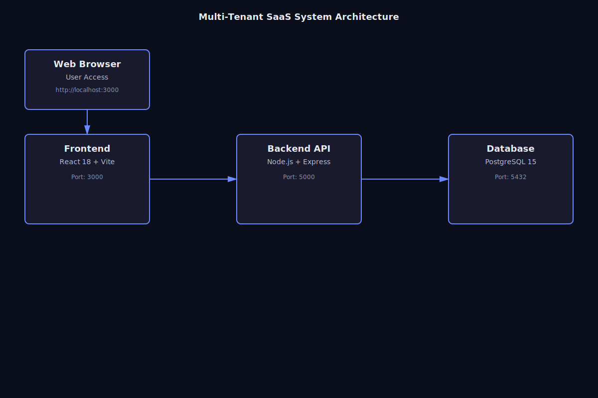
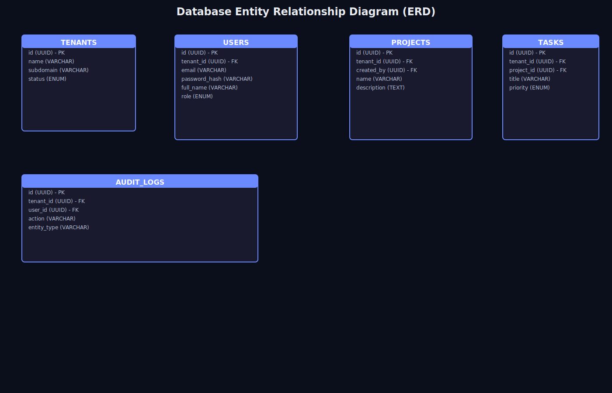

# Multi-Tenant SaaS Project Management Platform

A production-ready **Multi-Tenant SaaS Project & Task Management platform** designed for organizations to manage users, projects, and tasks with strict tenant-level data isolation. The system supports **multiple tenants**, role-based access control, and scalable architecture using Docker.

**Target Audience:**  
SaaS startups, enterprises, and developers building multi-tenant applications with secure tenant isolation.

---

## 🚀 Features

- **Multi-tenant architecture** with strict tenant data isolation
- **Tenant registration** with subdomain-based login
- **Role-based access control** (super_admin, tenant_admin, user)
- **JWT-based authentication** & authorization
- **Project management** with creation, update, deletion, and ownership rules
- **Task management** with assignment, priority, status tracking, and filtering
- **Real-time dashboard** with statistics and analytics
- **User management** (add/edit/delete users per tenant)
- **Subscription plan limits** (projects/users enforcement)
- **Audit logging** for critical actions and tenant activity
- **Fully Dockerized** (frontend, backend, database)
- **Health check endpoint** for production monitoring
- **Responsive UI** with modern dark theme design

---

## 🧱 Technology Stack

### Frontend
- **React 18** - Modern UI library
- **Vite** - Fast build tool and dev server
- **Axios** - HTTP client with interceptors
- **React Router DOM** - Client-side routing
- **CSS3** - Custom responsive styling

### Backend
- **Node.js 18** - JavaScript runtime
- **Express.js** - Web application framework
- **PostgreSQL (pg)** - Database driver
- **JWT (jsonwebtoken)** - Secure authentication
- **bcrypt** - Password hashing

### Database
- **PostgreSQL 15** - Relational database with advanced features
- **Migrations** - Version-controlled schema management
- **Seed data** - Automated test data loading

### DevOps & Containerization
- **Docker** - Containerization platform
- **Docker Compose** - Multi-container orchestration
- **Health Checks** - Service monitoring and readiness

---

## 🏗 Architecture Overview

The system follows a **service-based multi-tenant architecture**:

### Key Architecture Principles
- **Single backend API** serving multiple tenants
- **Tenant ID** embedded in JWT tokens and enforced on every request
- **Database-level isolation** using tenant_id foreign keys
- **Row-level security** preventing cross-tenant data access
- **Middleware-based authorization** for role and tenant validation
- **Automatic migrations** and seed data on startup

### System Components
1. **Frontend (React + Vite)** - Port 3000
2. **Backend API (Node.js + Express)** - Port 5000
3. **Database (PostgreSQL 15)** - Port 5432

### Architecture Diagrams



**The diagram above shows:**
- Web browser client connecting to frontend (port 3000)
- Frontend communicating with backend API (port 5000) via REST + JWT
- Backend querying PostgreSQL database (port 5432)
- Authentication flow with JWT token generation and tenant isolation
- Data filtering by tenant_id at every layer

### Database Design



**The ERD shows:**
- **TENANTS** table: Tenant information and subscription plans
- **USERS** table: User accounts with tenant_id and role-based access
- **PROJECTS** table: Tenant projects with creation tracking
- **TASKS** table: Project tasks with assignments and priority
- **AUDIT_LOGS** table: Activity tracking for compliance
- **Relationships:** All tables linked by tenant_id for strict isolation

---

## 📚 Documentation

Complete documentation is available in the `docs/` folder:

- **[Architecture](docs/architecture.md)** - System design, database ERD, API endpoints
- **[PRD (Product Requirements)](docs/PRD.md)** - User personas, functional and non-functional requirements
- **[Research](docs/research.md)** - Multi-tenancy analysis, technology stack justification, security considerations
- **[Technical Specification](docs/technical-spec.md)** - Project structure, development setup, Docker configuration

---

## ⚙️ Installation & Setup

### Prerequisites
- **Docker** (v20.10+)
- **Docker Compose** (v2.0+)

That's it! No need to install Node.js, PostgreSQL, or any other dependencies.

---

### 🚀 Quick Start

**1. Clone the repository:**
```bash
git clone <your-repo-url>
cd multi-tenant-saas
```

**2. Start the application:**
```bash
docker-compose up -d
```

This single command will:
- Start PostgreSQL database (port 5432)
- Run database migrations automatically
- Load seed data automatically
- Start backend API (port 5000)
- Start frontend application (port 3000)

**3. Verify services are running:**
```bash
docker-compose ps
```

**4. Access the application:**
- Frontend: http://localhost:3000
- Backend API: http://localhost:5000
- Health Check: http://localhost:5000/api/health

**5. Login with test credentials:**

See [Test Credentials](#-test-credentials) section below.

---

## 🔑 Test Credentials

All test credentials are documented in `submission.json`. Use these to test the application:

### Super Admin (System-wide access)
- **Email:** superadmin@system.com
- **Password:** Admin@123
- **Role:** super_admin

### Tenant Admin (Demo Company)
- **Email:** admin@demo.com
- **Password:** Demo@123
- **Role:** tenant_admin
- **Tenant:** Demo Company (subdomain: demo)

### Regular Users (Demo Company)
- **User 1:**
  - Email: user1@demo.com
  - Password: User@123
  - Role: user

- **User 2:**
  - Email: user2@demo.com
  - Password: User@123
  - Role: user

### Pre-seeded Data
- **Tenant:** Demo Company (pro plan, 25 max users, 15 max projects)
- **Projects:** Project Alpha, Project Beta
- **Tasks:** Design UI, Create API, Write Docs (with assignments)

---

## 🧪 Testing the Application

### 1. Test Health Check
```bash
curl http://localhost:5000/api/health
```

Expected response:
```json
{
  "status": "healthy",
  "database": "connected",
  "timestamp": "2025-12-31T..."
}
```

### 2. Test Login API
```bash
curl -X POST http://localhost:5000/api/auth/login \
  -H "Content-Type: application/json" \
  -d '{"email":"admin@demo.com","password":"Demo@123"}'
```

### 3. Test Frontend
- Navigate to http://localhost:3000
- Login with admin@demo.com / Demo@123
- Explore Dashboard, Projects, Users, Tasks

---

## 📋 API Endpoints

The backend exposes **20+ REST API endpoints**. Complete API documentation is available in [docs/API.md](docs/API.md).

### Authentication (4 endpoints)
- `POST /api/auth/register-tenant` - Register new tenant
- `POST /api/auth/login` - User login
- `GET /api/auth/me` - Get current user
- `POST /api/auth/logout` - User logout

### Tenants (3 endpoints)
- `GET /api/tenants/:tenantId` - Get tenant details
- `PUT /api/tenants/:tenantId` - Update tenant
- `GET /api/tenants` - List all tenants (super admin)

### Users (4 endpoints)
- `POST /api/tenants/:tenantId/users` - Add user to tenant
- `GET /api/tenants/:tenantId/users` - List tenant users
- `PUT /api/users/:userId` - Update user
- `DELETE /api/users/:userId` - Delete user

### Projects (5 endpoints)
- `POST /api/projects` - Create project
- `GET /api/projects` - List projects (tenant-scoped)
- `GET /api/projects/:id` - Get project details
- `PUT /api/projects/:projectId` - Update project
- `DELETE /api/projects/:projectId` - Delete project

### Tasks (4 endpoints)
- `POST /api/projects/:projectId/tasks` - Create task
- `GET /api/projects/:projectId/tasks` - List tasks
- `PATCH /api/tasks/:taskId/status` - Update task status
- `PUT /api/tasks/:taskId` - Update task

### Health Check (1 endpoint)
- `GET /api/health` - Service health status

---

## 🐳 Docker Configuration

### Services

**Database Service:**
- Image: postgres:15
- Port: 5432:5432
- Volume: Persistent data storage
- Health check: Postgres readiness probe

**Backend Service:**
- Build: ./backend/Dockerfile
- Port: 5000:5000
- Auto-runs: Migrations + Seed data on startup
- Health check: HTTP endpoint probe
- Environment variables: All configured in docker-compose.yml

**Frontend Service:**
- Build: ./frontend/Dockerfile
- Port: 3000:3000
- Vite dev server with hot reload

### Useful Commands

**View logs:**
```bash
docker-compose logs -f backend
docker-compose logs -f frontend
docker-compose logs -f database
```

**Restart services:**
```bash
docker-compose restart backend
docker-compose restart frontend
```

**Stop and remove all containers:**
```bash
docker-compose down
```

**Stop and remove all containers + volumes (fresh start):**
```bash
docker-compose down -v
docker-compose up -d
```

**Rebuild services:**
```bash
docker-compose build --no-cache
docker-compose up -d
```

---

## 📁 Project Structure

```
multi-tenant-saas/
├── backend/
│   ├── Dockerfile
│   ├── package.json
│   ├── seeds/
│   │   └── seed.js
│   └── src/
│       ├── app.js
│       ├── server.js
│       ├── config/
│       │   └── db.js
│       ├── controllers/
│       │   ├── auth.controller.js
│       │   ├── project.controller.js
│       │   ├── task.controller.js
│       │   ├── tenant.controller.js
│       │   └── user.controller.js
│       ├── middleware/
│       │   ├── auth.middleware.js
│       │   ├── error.middleware.js
│       │   ├── rbac.middleware.js
│       │   └── tenant.middleware.js
│       ├── migrations/
│       │   ├── 001_create_tenants.sql
│       │   ├── 002_create_users.sql
│       │   ├── 003_create_projects.sql
│       │   ├── 004_create_tasks.sql
│       │   └── 005_create_audit_logs.sql
│       ├── routes/
│       │   ├── auth.routes.js
│       │   ├── project.routes.js
│       │   ├── task.routes.js
│       │   ├── tenant.routes.js
│       │   └── user.routes.js
│       ├── services/
│       │   └── audit.service.js
│       └── utils/
│           ├── jwt.js
│           ├── response.js
│           ├── runMigrations.js
│           └── runSeeds.js
├── frontend/
│   ├── Dockerfile
│   ├── package.json
│   ├── vite.config.js
│   └── src/
│       ├── App.jsx
│       ├── main.jsx
│       ├── api/
│       │   └── axiosClient.js
│       ├── components/
│       │   ├── Navbar.jsx
│       │   ├── ProjectModal.jsx
│       │   ├── UserModal.jsx
│       │   ├── ProtectedRoute.jsx
│       │   └── HomeRedirect.jsx
│       ├── context/
│       │   └── AuthContext.jsx
│       └── pages/
│           ├── Login.jsx
│           ├── Register.jsx
│           ├── Dashboard.jsx
│           ├── Projects.jsx
│           ├── ProjectDetails.jsx
│           └── Users.jsx
├── docs/
│   ├── architecture.md
│   ├── PRD.md
│   ├── research.md
│   └── technical-spec.md
├── docker-compose.yml
├── submission.json
└── README.md
```

---

## 🔒 Security Features

- **Password hashing** with bcrypt (salt rounds: 10)
- **JWT authentication** with secure secret keys
- **Role-based authorization** middleware
- **Tenant isolation** enforcement on all queries
- **Input validation** and sanitization
- **SQL injection prevention** using parameterized queries
- **Error handling** without exposing sensitive information
- **Audit logging** for critical operations

---

## 🚀 Deployment Notes

This application is production-ready with:
- Health check endpoints for load balancers
- Database connection pooling
- Proper error handling and logging
- Environment-based configuration
- Docker containerization for consistent deployment
- Automated database migrations
- Volume persistence for data

---

## 📄 License

This project is part of an academic/professional submission.

---

## 👨‍💻 Author

Developed as part of Multi-Tenant SaaS Platform Assignment

---

## 🙏 Acknowledgments

Built with modern technologies and best practices for multi-tenant SaaS applications
